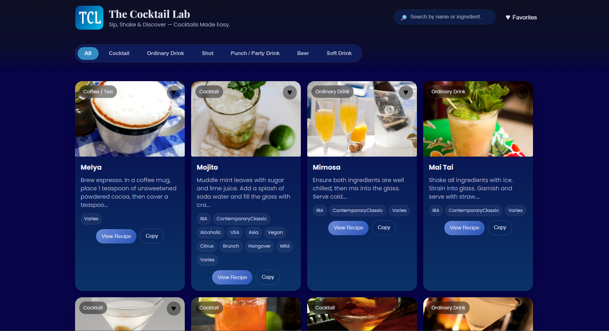
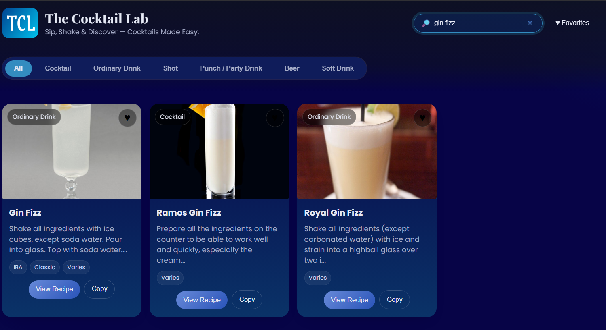
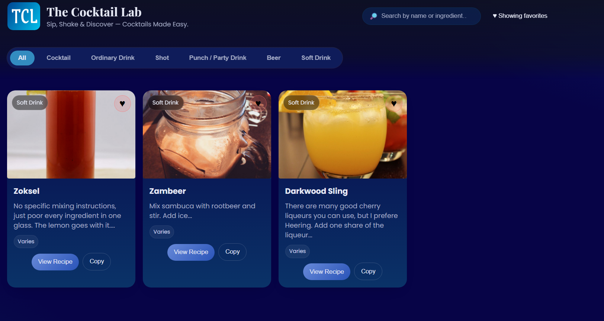

# 🍹 The Cocktail Lab

> Sip, Shake & Discover — Cocktails Made Easy.

A cocktail discovery web app that lets users search, filter, and save their favourite drink recipes — powered by the free TheCocktailDB API.

**Live Demo → [ajay-naik.github.io/Cocktail-Website](https://ajay-naik.github.io/Cocktail-Website/)**

---

## Features

- **Search** by cocktail name or ingredient in real time
- **Filter by category** — Cocktail, Ordinary Drink, Shot, Punch/Party Drink, Beer, Soft Drink
- **Search** by cocktail name or ingredient in real time
- **View full recipe** in a modal — ingredients, method, glass type, and tags
- **Copy recipe** to clipboard with one click
- **Save favourites** — persisted in localStorage, survives page refresh
- **Progressive loading** — initial drinks appear instantly, rest load in background

---

## Screenshots

| Home | Search | Favourites |
|------|--------|------------|
|  |  |  |

---

## Tech Stack

| Layer | Technology |
|-------|-----------|
| Frontend | HTML, CSS, Vanilla JavaScript |
| API | [TheCocktailDB](https://www.thecocktaildb.com/api.php) (free tier) |
| Storage | localStorage (favourites) |
| Hosting | GitHub Pages |

---

## How It Works

1. On load, the app fetches cocktails from TheCocktailDB by alphabet — first loading `m`, `g`, `s` for fast initial render, then lazily loading the remaining letters in the background
2. Each card displays the drink image, category badge, truncated instructions, and ingredient tags
3. Clicking **View Recipe** opens a modal with full ingredients list and step-by-step method
4. Clicking **♥** saves the drink to localStorage; the Favourites toggle filters to saved drinks only
5. Search queries match against name, category, description, tags, and ingredients simultaneously

---

## Project Structure

```
Cocktail-Website/
├── index.html       # App shell + card template
├── style.css        # Styling and layout
├── script.js        # API fetching, rendering, modal, favourites logic
└── logo.png         # TCL brand logo
```

---

## Known Limitations

- Not responsive — optimised for desktop only
- Relies on TheCocktailDB free tier (rate limits may apply)
- No backend — all state is client-side

---

## Built During

**Codanto Full-Stack Internship** (August – October 2025)

---

## Future Improvements

- [ ] Responsive/mobile layout
- [ ] Random cocktail button
